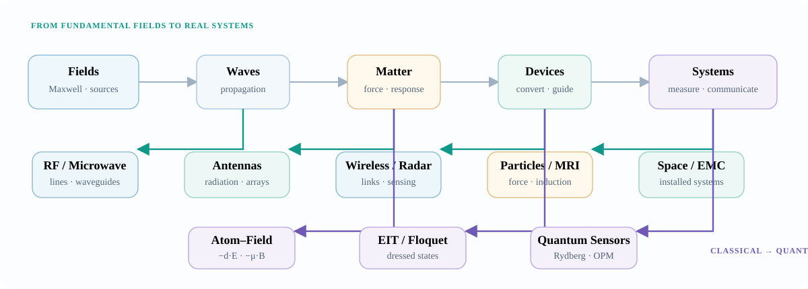

Fields → waves → matter → devices → systems → applications

<h1>Applications of Electromagnetics</h1>

A connected engineering and physics reference built for <strong>understanding, calculation, measurement, simulation, and revision</strong> — from Maxwell's equations to antennas, spacecraft, MRI, accelerators, atomic sensors, and quantum technologies.

<a class="button primary" href="knowledge-map/">Explore the Knowledge Map</a>
<a class="button" href="reference/">Open Quick Reference</a>
<a class="button" href="calculators/">Use Calculators</a>
<a class="button" href="measurements/">Measurements & Instruments</a>

<figure class="hero-map">

<figcaption>A compact map of the reference: classical field theory branches into engineering systems and the atom–field interactions used in quantum sensing.</figcaption>
</figure>

RT

<strong>Curated by Rajavardhan Talashila.</strong> This reference connects classical RF/microwave engineering, electromagnetics, measurement science, atomic physics, and Rydberg/quantum sensing. <a href="about/">Purpose, author context, and source policy →</a>

## Reference tools

<a class="reference-card" data-symbol="MAP" href="knowledge-map/">Map<strong>Knowledge Map</strong>Connections among fields, waves, forces, circuits, antennas, sensors and quantum interactions.</a>
<a class="reference-card" data-symbol="Σ" href="reference/">Reference<strong>Quick Reference</strong>Equations, scales, comparisons, scaling laws, derivations, misconceptions and history.</a>
<a class="reference-card" data-symbol="123" href="worked-examples/">Examples<strong>Worked Examples</strong>Numerical examples spanning RF, antennas, radar, optics, magnetometry and quantum sensing.</a>
<a class="reference-card" data-symbol="ƒx" href="calculators/">Calculator<strong>Interactive Calculators</strong>Wavelength, link budget, noise, skin depth, cutoff, radar, Larmor, Rabi and Halbach calculations.</a>
<a class="reference-card" data-symbol="VNA" href="measurements/">Measurement<strong>Measurements & Instruments</strong>VNA, spectrum analyzer, VSA, oscilloscope, field probes, chambers, optical detectors and calibration.</a>
<a class="reference-card" data-symbol="∂t" href="simulations/">Simulation<strong>Simulation Library</strong>Python-ready models for arrays, waves, charged particles, resonances, Stark/Zeeman and atomic sensing.</a>
<a class="reference-card" data-symbol="Δ" href="theory-experiment/">Validation<strong>Theory ↔ Experiment</strong>Observable-first modeling, residuals, independent calibration and model validation.</a>
<a class="reference-card" data-symbol="GPU" href="computational-methods/">Computing<strong>Computational Methods</strong>Numerical workflows, CUDA/GPU computing, Julia and scientific-computing methods.</a>
<a class="reference-card" data-symbol="DOI" href="literature/">Sources<strong>Literature Guide</strong>Foundational papers, modern reviews, representative experiments and institutional sources.</a>
<a class="reference-card" data-symbol="PDF" href="presentations/">Lectures<strong>Presentations & Lectures</strong>Curated technical presentations from universities, NASA, CERN and research institutions.</a>

## The knowledge map

<a href="foundations/">Fields & Maxwell</a>→
<a href="foundations/electromagnetic-waves.html">Waves</a>→
<a href="rf-microwave/">Guided waves & circuits</a>→
<a href="antennas/">Radiation & antennas</a>→
<a href="wireless/">Wireless systems</a>→
<a href="aesa/">Arrays</a>→
<a href="radar/">Radar</a>

<a href="foundations/">Fields</a>→
<a href="lorentz-force/">Force on charge</a>→
<a href="subatomic-particles/">Particle motion</a>→
<a href="shockley-ramo/">Induced signal</a>→
<a href="measurements/">Electronics & measurement</a>

<a href="foundations/">Classical field</a>→
<a href="quantum/">$-\mathbf d\cdot\mathbf E$ / $-\boldsymbol\mu\cdot\mathbf B$</a>→
<a href="rydberg-semiclassical-effects/">EIT / AT / Floquet</a>→
<a href="ground-state-magnetometry/">Atomic magnetometry</a>→
<a href="measurements/">Optical/RF readout</a>

[Open the complete clickable map →](knowledge-map/)

## Core electromagnetics

<a class="reference-card" data-symbol="∇" href="foundations/"><strong>Foundations</strong>Maxwell equations, boundary conditions, waves, polarization, energy and Poynting flow.</a>
<a class="reference-card" data-symbol="Z₀" href="rf-microwave/"><strong>RF & Microwave</strong>Transmission lines, Smith chart, S-parameters, waveguides, resonators, filters and networks.</a>
<a class="reference-card" data-symbol="G" href="antennas/"><strong>Antennas & Radiation</strong>Dipoles, loops, patches, horns, aperture, gain, polarization, near/far field and measurement.</a>
<a class="reference-card" data-symbol="H" href="wireless/"><strong>Wireless & MIMO</strong>Propagation, link budgets, channel matrices, rank, multiplexing, beamforming and EVM.</a>
<a class="reference-card" data-symbol="AF" href="aesa/"><strong>AESA & Phased Arrays</strong>Array factor, steering, T/R modules, scan loss, grating lobes, calibration and thermal limits.</a>
<a class="reference-card" data-symbol="R⁴" href="radar/"><strong>Radar & Remote Sensing</strong>Radar equation, range/Doppler, FMCW, RCS, phased arrays, SAR and measurement limits.</a>
<a class="reference-card" data-symbol="EMC" href="emc/"><strong>EMI / EMC</strong>Emissions, immunity, coupling, shielding, grounding, crosstalk, compliance and troubleshooting.</a>
<a class="reference-card" data-symbol="λ" href="optics-photonics/"><strong>Optics & Photonics</strong>Fresnel physics, diffraction, fibers, lasers, guided optics and photonic systems.</a>
<a class="reference-card" data-symbol="ΦB" href="power-energy/"><strong>Power & Energy</strong>Induction, transformers, motors, generators, magnetic materials and wireless power.</a>
<a class="reference-card" data-symbol="B₀" href="medical/"><strong>Medical Electromagnetics</strong>MRI, RF coils, SAR, microwave imaging, ablation, hyperthermia and implants.</a>

## Fields, particles and induced signals

<a class="reference-card" data-symbol="qF" href="lorentz-force/"><strong>Lorentz Force</strong>Electric and magnetic forces on charges, charged-particle motion, crossed fields and relativistic form.</a>
<a class="reference-card" data-symbol="Ew" href="shockley-ramo/"><strong>Shockley–Ramo Theorem</strong>Weighting fields, induced current, detector signals, moving charges, TIA readout and magnetic-field effects.</a>
<a class="reference-card" data-symbol="q/m" href="subatomic-particles/"><strong>Subatomic Particles & Accelerators</strong>Particle discovery, electromagnetic acceleration, bending, focusing, detection and spectrometry.</a>

## Atomic, quantum, space and precision systems

<a class="reference-card" data-symbol="ℏ" href="quantum/"><strong>Quantum Technologies</strong>Atom–field interaction, Rabi coupling, Stark/Zeeman physics, cavities, sensing and conversion.</a>
<a class="reference-card" data-symbol="EIT" href="rydberg-semiclassical-effects/"><strong>Rydberg Semiclassical Optics</strong>EIT, AT splitting, dressed/Floquet states, multiphoton physics, nonlinearities and RF sensing.</a>
<a class="reference-card" data-symbol="ωL" href="ground-state-magnetometry/"><strong>Ground-State Magnetometry</strong>Larmor precession, optical pumping, SERF, CPT/EIT, RF magnetometry and Halbach arrays.</a>
<a class="reference-card" data-symbol="OPM" href="atomic-magnetometer/"><strong>Optically Pumped Atomic Magnetometers</strong>Zeeman interaction, spin polarization, Bloch dynamics, optical readout and scalar/vector magnetometry.</a>
<a class="reference-card" data-symbol="νH" href="hydrogen-maser/"><strong>Hydrogen Maser</strong>Hyperfine physics, stimulated microwave emission, cavities, stability and VLBI timing.</a>
<a class="reference-card" data-symbol="S/C" href="computational-em/"><strong>Spacecraft Electromagnetics</strong>Installed antenna patterns, coupling, EMC, satellite links, payloads and launch environments.</a>
<a class="reference-card" data-symbol="SQUID" href="gravity-probe-b/"><strong>Gravity Probe B</strong>Superconducting gyroscopes, London moment, SQUID readout and end-to-end precision engineering.</a>
<a class="reference-card" data-symbol="VLBI" href="earth-space/chandler-wobble-vlbi.html"><strong>VLBI, Chandler Wobble & Earth Rotation</strong>Interferometric radio astronomy, precision timing, baseline geometry and Earth-orientation measurement.</a>

## Bookmarkable references

<a class="reference-card" data-symbol="Eq" href="reference/fundamental-equations.html"><strong>Equation Sheet</strong>The relations most often reused across EM, RF, optics and atomic sensing.</a>
<a class="reference-card" data-symbol="10ⁿ" href="reference/orders-of-magnitude.html"><strong>Orders of Magnitude</strong>Wavelengths, powers, fields, timescales and noise levels.</a>
<a class="reference-card" data-symbol="∝" href="reference/scaling-laws.html"><strong>Scaling Laws</strong>Dependence on frequency, distance, size, $n$, bandwidth and field.</a>
<a class="reference-card" data-symbol="vs" href="reference/comparison-tables.html"><strong>Comparison Tables</strong>FEM/FDTD/MoM, antennas, radar types, magnetometers, homodyne/heterodyne and more.</a>
<a class="reference-card" data-symbol="≠" href="reference/common-misconceptions.html"><strong>Common Misconceptions</strong>Short corrections for ideas that routinely cause errors in EM and quantum sensing.</a>
<a class="reference-card" data-symbol="⇒" href="reference/derivations.html"><strong>Essential Derivations</strong>Selected derivations where the mathematics reveals useful physical structure.</a>
<a class="reference-card" data-symbol="t" href="reference/history-timeline.html"><strong>History Timeline</strong>Major developments from Coulomb, Faraday and Maxwell to RF engineering and modern field metrology.</a>
<a class="reference-card" data-symbol="∫dt" href="reference/equation-history.html"><strong>History Behind the Equations</strong>Historical context for the equations that shaped electromagnetics.</a>

## Technical page structure

Mature topic pages use a consistent reference format: **physical intuition, governing equations and assumptions, worked examples, visualizations or simulations, measurement methods, engineering limitations, literature, and related topics.**

Engineering realityFinite geometry, loss, parasitics, bandwidth, calibration, temperature, uncertainty, tolerances, nonlinearity and noise determine how closely real systems follow ideal equations.

MeasurementThe <a href="measurements/">Measurements & Instruments</a> section connects field theory to VNA/VSA/spectrum-analyzer/oscilloscope methods, field probes, antenna ranges, photodetection, calibration and uncertainty.

## External resources

The [Presentations & Lectures](presentations/) library contains curated institutional material from MIT, CERN, NASA and universities. The [Literature Guide](literature/) collects foundational papers, modern reviews, representative experiments and institutional resources.
