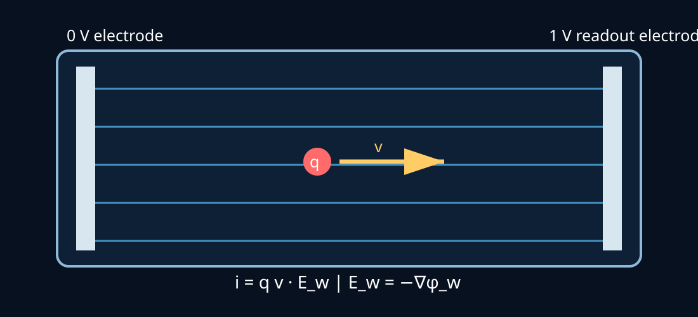

# Shockley–Ramo Theorem and Induced Current

<figure class="topic-figure">
  
  <figcaption>Weighting-field picture of Shockley–Ramo signal induction. Diagram redrawn for this reference from the weighting-field construction used in CERN/DESY detector training material. <a href="https://indico.cern.ch/event/1252505/contributions/5365826/attachments/2651554/4591315/MADRV_WP.pdf">Image source</a>.</figcaption>
</figure>

The **Shockley–Ramo theorem** is one of the most useful results for understanding how the motion of charge inside a detector, vacuum device, semiconductor, plasma, or electrode structure produces a measurable current at an external electrode.

Its key insight is subtle:

> A charge does **not** have to physically arrive at an electrode before that electrode can measure a current.

As soon as a charge moves through the device, its changing electric coupling to the electrodes induces current in the external circuit.

This distinction is especially important in particle detectors, semiconductor detectors, ionization chambers, vacuum electronics, gaseous detectors, and experiments involving slowly moving ions and rapidly moving electrons.

---

## 1. Core Shockley–Ramo equation

For a point charge $q$ moving with velocity $\mathbf v$ at position $\mathbf r$, the instantaneous current induced on electrode $k$ is

$$
\boxed{
i_k=q\,\mathbf v\cdot\mathbf E_{w,k}
}
$$

up to the sign convention used for electrode current and weighting potential.

Here $\mathbf E_{w,k}$ is the **weighting field** associated with electrode $k$.

Some references define $\mathbf E_w=-\nabla\phi_w$ and write the electrode-current convention with an explicit minus sign. The important point is to define the current direction and weighting-field convention consistently.

The theorem separates the problem into two pieces:

$$
\boxed{
\text{charge motion}
\quad + \quad
\text{electrode geometry}
\quad\rightarrow\quad
\text{induced current}
}
$$

The actual electric field determines how the particle moves.

The weighting field determines how strongly that motion is observed by a particular electrode.

These are **not the same field**.

---

# 2. Weighting potential

For electrode $k$, define the weighting potential $\phi_{w,k}$ by solving the electrostatic Laplace problem

$$
\nabla\cdot
\left(
\epsilon\nabla\phi_{w,k}
\right)=0
$$

with boundary conditions

$$
\phi_{w,k}=1
$$

on the electrode of interest and

$$
\phi_{w,k}=0
$$

on all other electrodes.

Any actual operating voltages, moving charges, space charge, and signal voltages are removed when calculating this auxiliary field.

The weighting field is then

$$
\boxed{
\mathbf E_{w,k}=-\nabla\phi_{w,k}
}.
$$

The weighting potential is dimensionless if the selected electrode is assigned unit potential. Consequently the weighting field has units of inverse length.

---

# 3. Actual electric field versus weighting field

This is the most important conceptual distinction.

## Actual field

The physical electric field satisfies the device's electrostatic/electrodynamic problem and determines force:

$$
\mathbf F=q\left(\mathbf E+\mathbf v\times\mathbf B\right).
$$

It determines acceleration, drift velocity, trajectory, collision dynamics, and collection.

## Weighting field

The weighting field is a mathematical field determined primarily by electrode geometry and dielectric structure.

It answers:

> If a charge moves here, how sensitive is this electrode to that motion?

Therefore a simulation often has two stages:

$$
\boxed{
\mathbf E,\mathbf B
\rightarrow
\text{particle trajectory }\mathbf r(t),\mathbf v(t)
}
$$

followed by

$$
\boxed{
\mathbf r(t),\mathbf v(t),\mathbf E_w
\rightarrow
i(t)
}.
$$

---

# 4. Induced charge

Because

$$
\mathbf E_w=-\nabla\phi_w,
$$

the induced current can be related to the time derivative of weighting potential.

For a moving point charge, one common convention gives

$$
i=q\mathbf v\cdot\mathbf E_w
=-q\frac{d\phi_w}{dt}.
$$

Integrating over a trajectory from initial point $\mathbf r_i$ to final point $\mathbf r_f$ gives the induced charge, with sign depending on the electrode-current convention,

$$
Q_{ind}
=
q[
\phi_w(\mathbf r_i)
-
\phi_w(\mathbf r_f)
].
$$

Thus the total signal depends on the **change in weighting potential along the trajectory**, not simply the distance traveled.

---

# 5. Parallel-plate example

Consider two large parallel electrodes separated by distance $d$.

For the readout electrode at $x=d$,

$$
\phi_w(x)=\frac{x}{d},
$$

and

$$
\mathbf E_w=-\frac{1}{d}\hat{\mathbf x}
$$

under the conventional definition $\mathbf E_w=-\nabla\phi_w$.

Ignoring sign convention and considering magnitude,

$$
\boxed{|i|=\frac{|qv_x|}{d}}.
$$

A charge moving parallel to the plates has

$$
\mathbf v\cdot\mathbf E_w=0
$$

and therefore contributes no ideal Shockley–Ramo current to that electrode pair.

This illustrates why **trajectory direction matters as much as speed**.

---

# 6. Many particles

For many discrete charges,

$$
i_k(t)
=
\sum_j
q_j\mathbf v_j(t)
\cdot
\mathbf E_{w,k}[\mathbf r_j(t)].
$$

This equation is extremely useful in Monte Carlo simulations.

For a continuous current density $\mathbf J(\mathbf r,t)$,

$$
\boxed{
i_k(t)
=
\int_V
\mathbf J(\mathbf r,t)
\cdot
\mathbf E_{w,k}(\mathbf r)
\,d^3r
}
$$

subject again to sign convention.

This connects microscopic particle tracking to macroscopic current measurements.

---

# 7. Electrons versus ions

Electrons and positive ions have opposite charge signs:

$$
q_e=-e,
\qquad
q_i=+e.
$$

Their induced-current contributions are therefore

$$
i_e=q_e\mathbf v_e\cdot\mathbf E_w,
$$

and

$$
i_i=q_i\mathbf v_i\cdot\mathbf E_w.
$$

Because electrons usually move much faster than ions, electron signals often have faster temporal components. Ions can produce slower tails.

However, signal polarity is not determined by charge sign alone. It depends on

$$
\boxed{q\,\mathbf v\cdot\mathbf E_w}.
$$

A negative charge moving one direction can produce the same current sign as a positive charge moving in the opposite direction.

---

# 8. Why current appears before charge collection

Suppose an electron-ion pair is created between two electrodes.

Immediately after creation, the electron and ion begin moving. Their positions relative to the electrodes change.

The electrode surface charges must rearrange to satisfy the electrostatic boundary conditions.

That redistribution produces current in the external circuit.

Therefore:

$$
\boxed{
\text{particle motion}
\neq
\text{particle arrival}
}
$$

and

$$
\boxed{
\text{induced current can exist throughout the trajectory}.
}
$$

This is one of the central physical insights of the theorem.

---

# 9. Magnetic fields

The weighting field itself is normally obtained from the auxiliary electrostatic problem and does not directly contain the applied magnetic field.

However, a magnetic field changes particle trajectories through the Lorentz force:

$$
m\frac{d\mathbf v}{dt}
=
q(\mathbf E+\mathbf v\times\mathbf B)
+
\mathbf F_{collisions}.
$$

Therefore

$$
\mathbf B
\rightarrow
\mathbf v(t),\mathbf r(t)
\rightarrow
\mathbf v\cdot\mathbf E_w
\rightarrow
i(t).
$$

A magnetic field can consequently alter the magnitude, waveform, timing, or even sign of the measured induced current if it changes the velocity component projected onto the weighting field or changes which trajectories survive/terminate.

This is a useful connection to the [Lorentz-force](../lorentz-force/) section.

---

# 10. Cyclotron motion

For a charged particle in a uniform magnetic field,

$$
\omega_c=\frac{|q|B}{m}.
$$

The Larmor/cyclotron radius is

$$
r_c=\frac{mv_\perp}{|q|B}.
$$

Electrons have a much larger charge-to-mass ratio than heavy ions and are therefore deflected much more strongly for the same $B$ and velocity scale.

In gases and vapor cells, however, collisions can substantially modify ideal cyclotron motion. The relevant comparison is often between cyclotron frequency and collision rate:

$$
\boxed{\omega_c/\nu_{coll}}.
$$

When collisions dominate, coherent gyromotion is strongly interrupted.

---

# 11. Shockley–Ramo and a transimpedance amplifier

A transimpedance amplifier (TIA) converts input current into voltage:

$$
V_{out}\approx-I_{in}R_f
$$

within its usable bandwidth for the simplest feedback-resistor model.

Therefore a measured voltage waveform can originate from

$$
\boxed{
\text{charge motion}
\rightarrow
i_{SR}(t)
\rightarrow
\text{TIA}
\rightarrow
V_{out}(t).
}
$$

A more realistic model includes detector/electrode capacitance $C_d$, amplifier input capacitance, feedback capacitance $C_f$, finite op-amp gain-bandwidth, and cable/parasitic capacitance.

The measured waveform is therefore the Shockley–Ramo source current filtered by the detector and readout transfer function:

$$
V_{out}(\omega)
=
Z_T(\omega)I_{SR}(\omega).
$$

This distinction is important when comparing a particle simulation with an oscilloscope trace.

---

# 12. No applied voltage does not imply zero signal

A common misconception is that two electrodes with no DC bias cannot produce a signal.

The Shockley–Ramo theorem shows that a moving charge can induce current even without a deliberately applied collection voltage.

The actual trajectory can be driven by other mechanisms:

- initial kinetic energy;
- photoionization;
- thermal motion;
- plasma fields;
- space-charge fields;
- contact potentials;
- patch potentials;
- RF fields;
- magnetic-field-modified motion;
- diffusion;
- ambipolar fields.

If

$$
\mathbf v\cdot\mathbf E_w\neq0,
$$

the motion can contribute to the electrode signal.

The absence of applied bias must therefore not be confused with the absence of weighting field. The weighting field is an auxiliary field defined by electrode geometry.

---

# 13. AC and RF-driven charge motion

Suppose an RF electric field drives a charge:

$$
\mathbf E(t)=\mathbf E_0\cos\omega t.
$$

The velocity acquires an oscillatory component and therefore

$$
i(t)
=
q\mathbf v(t)\cdot\mathbf E_w.
$$

With multiple RF fields,

$$
E(t)
=
E_{LO}\cos\omega_{LO}t+
E_s\cos\omega_st,
$$

nonlinear charge-generation or transport mechanisms can produce components at

$$
|\omega_{LO}-\omega_s|,
$$

as well as harmonics and intermodulation products.

The Shockley–Ramo theorem does not itself create nonlinear mixing. It provides the conversion from the resulting charge motion/current density to the electrode current. The nonlinear physics must enter through ionization, transport, field-dependent mobility, plasma dynamics, atomic response, or another mechanism.

---

# 14. Application to atomic vapor and Rydberg experiments

In an optically excited atomic vapor, a useful conceptual chain is

$$
\text{laser excitation}
\rightarrow
\text{Rydberg population}
\rightarrow
\text{ionization}
\rightarrow
e^-+\mathrm{Cs}^+
\rightarrow
\text{transport}
\rightarrow
\text{Shockley–Ramo current}.
$$

Possible ionization mechanisms include:

- blackbody photoionization;
- collisions between Rydberg atoms;
- Rydberg-ground collisions;
- associative ionization;
- Penning-type processes;
- photoionization by optical fields;
- RF-assisted ionization;
- field ionization.

The atomic physics determines **how many charges are produced and when**.

Transport physics determines **where they move**.

The weighting field determines **how their motion appears at the electrodes**.

The electronics determines **what waveform is finally measured**.

Thus a complete model should separate

$$
\boxed{
\text{atomic excitation}
\rightarrow
\text{ionization}
\rightarrow
\text{charged-particle transport}
\rightarrow
\text{induced current}
\rightarrow
\text{electronics}.
}
$$

---

# 15. Monte Carlo implementation

For particle $j$, propagate

$$
\frac{d\mathbf r_j}{dt}=\mathbf v_j,
$$

$$
m_j\frac{d\mathbf v_j}{dt}
=
q_j[
\mathbf E(\mathbf r_j,t)
+
\mathbf v_j\times\mathbf B
]
+
\mathbf F_{collision}.
$$

At every time step evaluate

$$
i_j(t)
=
q_j\mathbf v_j
\cdot
\mathbf E_w(\mathbf r_j).
$$

Then sum:

$$
I(t)=\sum_j i_j(t).
$$

A useful computational loop is:

1. Generate electron/ion pairs from the physical ionization model.
2. Sample initial positions and thermal/ionization velocities.
3. Interpolate actual $\mathbf E$ and $\mathbf B$ fields.
4. Advance trajectories.
5. Apply stochastic collisions.
6. Apply wall/electrode boundary conditions.
7. Interpolate $\mathbf E_w$.
8. Calculate $q\mathbf v\cdot\mathbf E_w$.
9. Sum all particle contributions.
10. Pass $I(t)$ through the measured TIA transfer function.

Large ensembles are natural candidates for the [CUDA/GPU methods](../computational-methods/) page because trajectories can often be evaluated in parallel.

---

# 16. Weighting-field simulation

For simple parallel plates, $\mathbf E_w$ can be calculated analytically.

For realistic finite plates, vapor cells, guard electrodes, dielectrics, windows, nearby grounded objects, and amplifier connections, solve

$$
\nabla\cdot(\epsilon\nabla\phi_w)=0
$$

numerically.

Possible tools include:

- FEM;
- finite differences;
- boundary-element methods;
- COMSOL;
- ANSYS;
- open-source electrostatic FEM packages.

The procedure is:

**set readout electrode = 1 V → all other conductors = 0 V → remove physical charges → solve Laplace equation → calculate $-\nabla\phi_w$.**

This field can then be stored on a grid and interpolated during Monte Carlo particle tracking.

---

# 17. Dielectrics and finite geometries

In realistic detector structures, dielectric interfaces alter the weighting field.

The generalized electrostatic equation is

$$
\nabla\cdot
[
\epsilon(\mathbf r)\nabla\phi_w
]
=0.
$$

This can matter in vapor cells because glass windows and nearby structures change capacitive coupling.

The infinite-parallel-plate approximation may therefore be insufficient when:

- plate dimensions are comparable to spacing;
- the sensing volume extends near plate edges;
- dielectric walls lie close to the particles;
- neighboring conductors are present.

---

# 18. Space charge

The classical weighting-field calculation is independent of the moving charges, but the **actual trajectory field** need not be.

For sufficiently large charge density, solve Poisson's equation:

$$
\nabla\cdot(\epsilon\mathbf E)
=
\rho.
$$

The particles then modify the field that drives later particle motion.

A self-consistent simulation can require:

$$
\rho
\rightarrow
\mathbf E
\rightarrow
\text{particle motion}
\rightarrow
\rho.
$$

This is the basis of particle-in-cell style modeling.

The weighting field remains a separate auxiliary field used for signal induction.

---

# 19. Diffusion and mobility

In a collisional medium, deterministic ballistic trajectories may not be sufficient.

A drift-diffusion description can use

$$
\mathbf J
=
q n\mu\mathbf E
-
qD\nabla n,
$$

with mobility $\mu$ and diffusion coefficient $D$.

The induced electrode current can then be calculated using

$$
i_k
=
\int
\mathbf J\cdot\mathbf E_{w,k}
\,dV.
$$

This provides a bridge between individual-particle Monte Carlo models and continuum transport models.

---

# 20. Signal polarity

The sign of the observed signal can depend on several layers:

1. sign of charge $q$;
2. particle velocity direction;
3. weighting-field direction;
4. which electrode is read out;
5. current sign convention;
6. TIA inversion;
7. AC coupling/filtering;
8. relative electron and ion contributions.

Therefore an observed voltage-polarity reversal should not immediately be interpreted as a reversal in the number of ions produced.

The correct chain is

$$
\boxed{
q\mathbf v\cdot\mathbf E_w
\rightarrow
I_{electrode}
\rightarrow
Z_T
\rightarrow
V_{measured}.
}
$$

This is particularly important when magnetic fields modify trajectories.

---

# 21. Shockley–Ramo versus collected current

It is useful to distinguish:

### Induced current
Produced while charge moves through the weighting field.

### Collection current
Associated with charge actually reaching an electrode.

### Displacement/capacitive current
Produced by time-varying fields and electrode capacitances.

### Leakage/dark current
Produced by finite insulation, electronics, surface conduction, or background processes.

An experimental signal can contain several of these simultaneously.

---

# 22. Applications

The Shockley–Ramo framework is used in:

- semiconductor radiation detectors;
- silicon strip and pixel detectors;
- high-purity germanium detectors;
- diamond detectors;
- ionization chambers;
- proportional counters;
- gaseous detectors;
- time-projection chambers;
- photoconductors;
- vacuum tubes;
- photomultipliers;
- avalanche detectors;
- plasma diagnostics;
- particle accelerators and beam monitors;
- detector pulse-shape analysis;
- radiation imaging;
- charge-transport simulations.

It is especially valuable whenever the **shape and timing of a measured electrical pulse must be connected to microscopic charge motion**.

---

# 23. Historical context

The theorem is associated primarily with **William Shockley** and **Simon Ramo**, who independently developed closely related formulations in the late 1930s.

Shockley's 1938 paper analyzed currents induced by moving point charges in electrode systems.

Ramo's 1939 paper, *Currents Induced by Electron Motion*, gave the formulation that became widely used in vacuum-tube and detector physics.

The theorem is sometimes called the **Shockley–Ramo theorem**, **Ramo theorem**, or, in generalized treatments, the **Shockley–Ramo–Gunn theorem**.

Later work extended the framework to semiconductor devices, detector systems, time-dependent media, and more general geometries.

---

# 24. Connection to reciprocity

The theorem is deeply connected to electrostatic reciprocity.

Instead of recalculating the electrode response for every possible charge position, solve one auxiliary weighting-field problem for the electrode.

Then any trajectory can be projected onto that field.

Computationally this is powerful:

$$
\boxed{
\text{one weighting-field solution}
+
\text{many particle trajectories}
\rightarrow
\text{many signal calculations}.
}
$$

This is why the method is exceptionally useful for Monte Carlo detector simulations.

---

# 25. Quick reference

| Quantity | Meaning |
|---|---|
| $\mathbf E$ | actual electric field driving the charge |
| $\mathbf B$ | actual magnetic field modifying trajectory |
| $\phi_w$ | dimensionless weighting potential |
| $\mathbf E_w=-\nabla\phi_w$ | weighting field |
| $q$ | particle charge |
| $\mathbf v$ | instantaneous particle velocity |
| $i=q\mathbf v\cdot\mathbf E_w$ | induced-current relation, subject to sign convention |
| $\mathbf J$ | current density |
| $i=\int\mathbf J\cdot\mathbf E_wdV$ | continuum form |
| $Z_T(\omega)$ | transimpedance/readout transfer function |

The shortest useful mental model is:

$$
\boxed{
\text{actual fields determine motion;}
\quad
\text{weighting fields determine signal}.
}
$$

---

# References and further reading

1. W. Shockley, “Currents to Conductors Induced by a Moving Point Charge,” *Journal of Applied Physics* **9**, 635–636 (1938). [DOI](https://doi.org/10.1063/1.1710367)
2. S. Ramo, “Currents Induced by Electron Motion,” *Proceedings of the IRE* **27**, 584–585 (1939). [DOI](https://doi.org/10.1109/JRPROC.1939.228757)
3. Z. He, “Review of the Shockley–Ramo theorem and its application in semiconductor gamma-ray detectors,” *Nuclear Instruments and Methods in Physics Research A* **463**, 250–267 (2001). [DOI](https://doi.org/10.1016/S0168-9002(01)00223-6)
4. G. Cavalleri et al., “Extension of Ramo's theorem as applied to induced charge in semiconductor detectors,” *Nuclear Instruments and Methods* — generalized detector formulations.
5. W. R. Smythe, *Static and Dynamic Electricity* — electrostatic reciprocity and electrode-field foundations.
6. G. F. Knoll, *Radiation Detection and Measurement*, Wiley — charge transport and signal formation in radiation detectors.
7. H. Spieler, *Semiconductor Detector Systems*, Oxford University Press — detector electronics, charge transport, noise and pulse formation.
8. W. Blum, W. Riegler and L. Rolandi, *Particle Detection with Drift Chambers*, Springer — weighting fields and signal formation in gaseous detectors.
9. W. Riegler, “Extended theorems for signal induction in particle detectors,” detector-physics literature — extensions of weighting-field methods.
10. CERN detector lecture material — practical weighting-field, induced-current and detector-signal treatments.

---

## Related pages

- [Lorentz Force](../lorentz-force/) — determines charged-particle trajectories in electric and magnetic fields.
- [Computational Methods](../computational-methods/) — CUDA/GPU and Julia methods useful for large Monte Carlo ensembles.
- [Fundamental Equations](../reference/fundamental-equations.html) — Maxwell equations and electromagnetic foundations.

---

[← Home](../)
