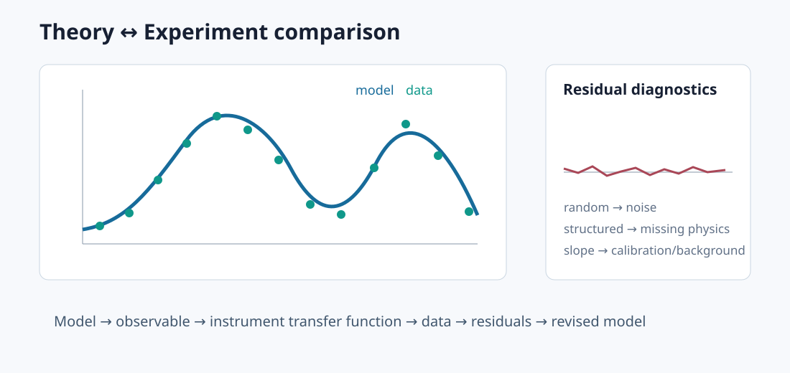

# Theory ↔ Experiment

<figure class="topic-figure">
  
  <figcaption>A reusable comparison pattern: put theory and data on the same observable, then use residual structure to diagnose missing physics, calibration error, or noise.</figcaption>
</figure>

A strong technical reference should not stop at an equation or a plot. The useful chain is

$$
\boxed{
\text{physical hypothesis}
\rightarrow
\text{model}
\rightarrow
\text{observable}
\rightarrow
\text{instrument transfer function}
\rightarrow
\text{data}
\rightarrow
\text{residuals}
}
$$

## 1. Start with the observable

Ask first: **what does the instrument actually output?**

Examples:

- VNA → complex wave ratio;
- photodetector → photocurrent/voltage, not atomic population directly;
- spectrum analyzer → filtered/detected spectral power;
- oscilloscope → bandwidth-limited voltage waveform;
- atomic receiver → optical transmission/phase/polarization encoding an RF-driven susceptibility.

## 2. Separate physics from readout

For a Rydberg current experiment, for example:

$$
\text{atomic excitation}
\rightarrow
\text{ionization}
\rightarrow
\text{particle transport}
\rightarrow
\text{Shockley–Ramo current}
\rightarrow
Z_T(\omega)
\rightarrow
V_{scope}.
$$

If the final voltage disagrees with theory, the disagreement can live in any layer.

## 3. Add realism in controlled steps

Do not begin with every complication. Use a ladder:

1. ideal analytic model;
2. measured geometry;
3. measured drive amplitudes;
4. finite linewidth/loss;
5. spatial averaging;
6. instrumental bandwidth;
7. temperature/drift;
8. interactions/nonlinearity;
9. uncertainty propagation.

At each step, ask whether the change improves the particular residual seen in data.

## 4. Compare shapes before amplitudes

A useful debugging order is:

- peak position;
- symmetry/asymmetry;
- linewidth;
- number of peaks;
- relative amplitudes;
- absolute scale.

Absolute amplitude is often the last thing to trust because it accumulates calibration errors from many layers.

## 5. Plot residuals

For data $y_i$ and model $m_i$,

$$r_i=y_i-m_i.$$

Residual structure is diagnostic:

- random scatter → noise-dominated;
- slope → calibration/background error;
- alternating structure → frequency-axis or phase issue;
- broadened central residual → missing linewidth/spatial averaging;
- systematic side features → missing states/modes/coupling pathways.

## 6. Use dimensionless comparisons

Before fitting many parameters, compare regime ratios such as

$$\Omega/\Gamma,\qquad \Omega/\Delta,\qquad ka,\qquad \omega_c/\nu_{coll},\qquad R/R_{FF}.
$$

These ratios often tell you what physics can plausibly matter.

## 7. Calibrate independently where possible

A parameter measured independently should not also be freely fitted unless you are explicitly testing its calibration.

Examples:

- RF field from AT calibration;
- laser power/waist → optical Rabi estimate;
- photodetector transfer function measured separately;
- magnetic field from atomic resonance;
- cable loss from VNA/power calibration.

## 8. Falsification tests

A good model should predict what happens when you deliberately change a control parameter that was not used to fit it.

Examples:

- reverse $B$;
- rotate polarization;
- change vapor-cell position;
- change beam waist;
- vary detector bandwidth;
- switch a Floquet replica order/basis size;
- change antenna distance from near to far field.

## 9. Theory ↔ experiment templates

### Antenna

**Maxwell/full-wave model → current distribution → far-field pattern → chamber transfer/calibration → measured pattern.**

### RF receiver

**signal source → channel → antenna/front end → gain/noise/nonlinearity → demodulator → EVM/BER.**

### Atomic sensor

**Hamiltonian → density matrix/Floquet → susceptibility → propagation → photodetection → electronics → measured spectrum/beat note.**

### Charged-particle detector

**field map → particle transport → weighting field → induced current → amplifier response → waveform.**

## 10. A reusable comparison figure

For publication-quality theory/experiment comparisons, show whenever possible:

- same axes and units;
- shared color scale;
- measured and simulated linewidths;
- residual panel or difference map;
- independently measured parameters listed in caption/table;
- fitted parameters explicitly labeled;
- uncertainty or repeatability indication.

Key principleA model is strongest when it predicts a new experimental change, not when it can reproduce one curve after enough fitting.

See [Measurements & Instruments](../measurements/), [Simulation Library](../simulations/), and [Scaling Laws](../reference/scaling-laws.html).
